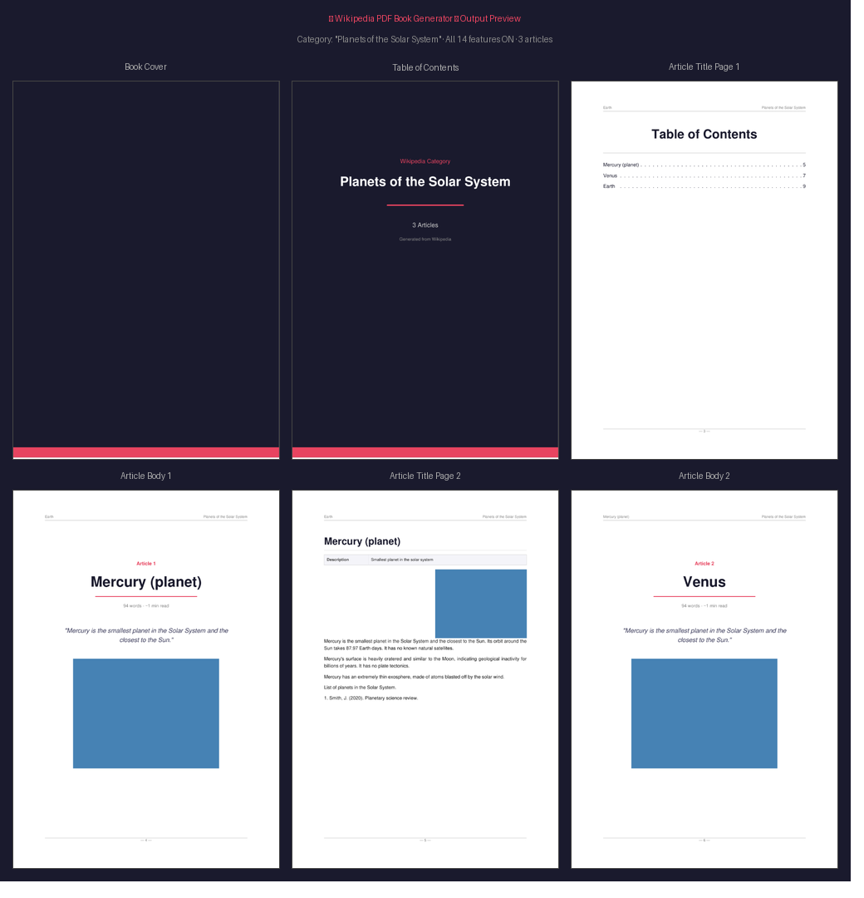

# 📚 Wikipedia Category PDF Book Generator

A Python script that generates a polished, book-like PDF from all articles in a Wikipedia category — complete with a cover page, table of contents, per-article title pages, inline images, and more.



## Features

All 14 features are **individually toggleable** via constants at the top of the script, and many can also be toggled from the command line:

| # | Feature | Flag | Default |
|---|---------|------|---------|
| 1 | Full decorative cover page for the book | `FEATURE_BOOK_COVER_PAGE` | ✅ On |
| 2 | Auto-generated table of contents with page numbers | `FEATURE_TABLE_OF_CONTENTS` | ✅ On |
| 3 | Dedicated title page before each article | `FEATURE_ARTICLE_TITLE_PAGES` | ✅ On |
| 4 | First sentence as a large italic quote on the title page | `FEATURE_FIRST_SENTENCE_QUOTE` | ✅ On |
| 5 | Article main image shown large on its title page | `FEATURE_COVER_IMAGE_ON_TITLE_PAGE` | ✅ On |
| 6 | Page numbers in the footer | `FEATURE_PAGE_NUMBERS` | ✅ On |
| 7 | Running article title + book name in the header | `FEATURE_RUNNING_HEADERS` | ✅ On |
| 8 | Fetch articles from subcategories (one level deep) | `FEATURE_RECURSIVE_SUBCATEGORIES` | ❌ Off |
| 9 | Inline images embedded in the article body | `FEATURE_ARTICLE_IMAGES_INLINE` | ✅ On |
| 10 | Estimated reading time on the title page | `FEATURE_READING_TIME_ESTIMATE` | ✅ On |
| 11 | Short description / infobox box at the start of each article | `FEATURE_INFOBOX_SUMMARY` | ✅ On |
| 12 | References / See Also / External Links sections | `FEATURE_ARTICLE_REFERENCES` | ❌ Off |
| 13 | Alphabetical article index at the back of the book | `FEATURE_CATEGORY_INDEX_PAGE` | ✅ On |
| 14 | Word count on each article title page | `FEATURE_ARTICLE_WORD_COUNT` | ✅ On |

## Requirements

Python 3.10+ and:

```
pip install -r requirements.txt
```

Which installs:
- **requests** — Wikipedia API calls
- **reportlab** — PDF generation
- **Pillow** — Image processing

## Usage

```bash
# Basic: generate a PDF from a Wikipedia category
python wiki_pdf_book.py "Planets of the Solar System"

# Custom output filename
python wiki_pdf_book.py "Nobel laureates in Physics" physics_laureates.pdf

# Limit article count
python wiki_pdf_book.py "Classical composers" --max-articles 20

# Include subcategories recursively
python wiki_pdf_book.py "Dogs" dogs.pdf --recursive

# Faster run without images
python wiki_pdf_book.py "Ancient Rome" rome.pdf --no-images

# Include references sections, omit cover
python wiki_pdf_book.py "Programming languages" langs.pdf --with-references --no-cover
```

### All CLI options

```
positional arguments:
  category              Wikipedia category name
  output                Output PDF path (default: <category>.pdf)

options:
  --max-articles N      Max articles to include (default 50, 0=unlimited)
  --recursive           Also fetch articles from subcategories
  --no-images           Skip all image downloads (much faster)
  --no-toc              Omit table of contents
  --no-cover            Omit book cover page
  --no-title-pages      Omit per-article title pages
  --with-references     Include References / See Also sections
```

## Finding Category Names

Category names are case-sensitive and must match Wikipedia exactly.

1. Go to any Wikipedia article, e.g. [Mercury (planet)](https://en.wikipedia.org/wiki/Mercury_(planet))
2. Scroll to the bottom — you'll see **Categories** like *"Planets of the Solar System"*
3. Click a category to see its page: the URL will be `wikipedia.org/wiki/Category:Planets_of_the_Solar_System`
4. The category name is everything after `Category:`, with underscores replaced by spaces

### Example categories to try

```bash
python wiki_pdf_book.py "Planets of the Solar System"
python wiki_pdf_book.py "Nobel laureates in Physics"
python wiki_pdf_book.py "Classical composers"
python wiki_pdf_book.py "Ancient Greek philosophers"
python wiki_pdf_book.py "Countries of Europe"
python wiki_pdf_book.py "Programming languages"
python wiki_pdf_book.py "World Heritage Sites in Italy"
```

## Output Structure

A typical output PDF contains:

```
[Cover page]           — Dark themed, category name, article count
[Table of Contents]    — Auto-generated, one entry per article with page number
[Article 1 Title Page] — Title, word count, reading time, quote, cover image
[Article 1 Body]       — Full article text with section headings, inline images
[Article 2 Title Page]
[Article 2 Body]
...
[Article Index]        — Alphabetical two-column index at the back
```

## Toggling Features

Edit the flags near the top of `wiki_pdf_book.py`:

```python
# Turn off images entirely for a text-only book
FEATURE_COVER_IMAGE_ON_TITLE_PAGE = False
FEATURE_ARTICLE_IMAGES_INLINE = False

# Include references sections
FEATURE_ARTICLE_REFERENCES = True

# Fetch subcategories too
FEATURE_RECURSIVE_SUBCATEGORIES = True

# Change inline image limit
MAX_INLINE_IMAGES = 3

# Change article cap
MAX_ARTICLES = 100
```

## Notes

- The script is polite to Wikipedia's servers (0.4 s delay between requests, proper User-Agent).
- Category names are **case-sensitive**.
- Very large categories (500+ articles) will take a long time; use `--max-articles` to limit.
- Images are downloaded at 800 px width and compressed to JPEG in the PDF.
